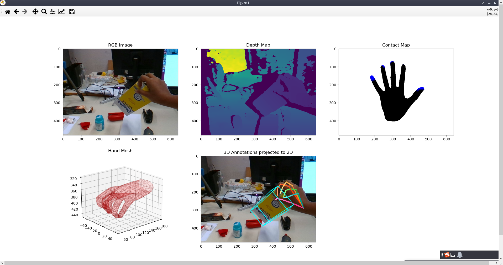

This repository is released as a fork, modified from  [shreyashampali/ho3d](https://github.com/shreyashampali/ho3d) . The original project only supports Python 2.7. I have updated it for Python 3.8 compatibility and added files such as `environment.yml` and `setup_environment.sh`. Thanks to the original author for their contribution.

The modifications include:
-   Trivial 2to3 modifications.
-   Specifying `encoding='latin1'` when opening pickle files.
-   Replacing deprecated type names like `np.int` according to NumPy 1.20.0 deprecation notices.
-   Patching `chumpy` by directly replacing relevant code.
-   Disabling automatic window maximization (for compatibility with various remote desktop environments).

# Create Environment
```
chmod +x setup_environment.sh
./setup_environment.sh
```

# Usage
For detailed instructions, please refer to [README_origin.md](README_origin.md#L64).

For example, to test a random sample from the HO3D training set, assuming the HO3D_v3 dataset is located at `/data/datasets/HO3D_v3`, mano_v1_2 are at `/data/datasets/mano_v1_2` and the YCB_Video_Models are at `/data/experiments/YCB_Video_Models/models`, use the following command:

```
python setup_mano.py /data/datasets/mano_v1_2
```
```
python vis_HO3D.py /data/datasets/HO3D_v3 /data/experiments/YCB_Video_Models/models -split train
```

This will generate a window similar to the one below (you may need to manually maximize it):
<div style="text-align:center"></div>